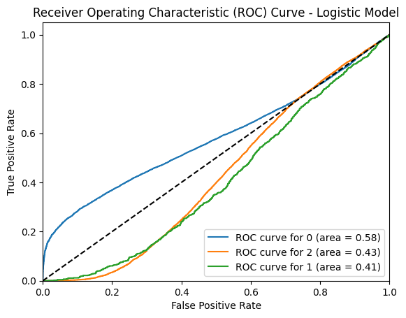
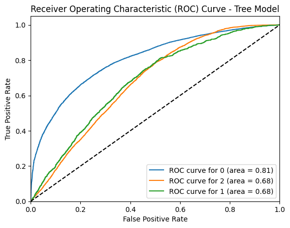
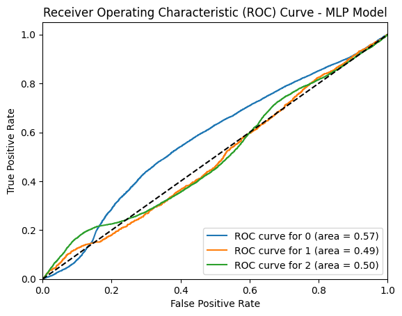
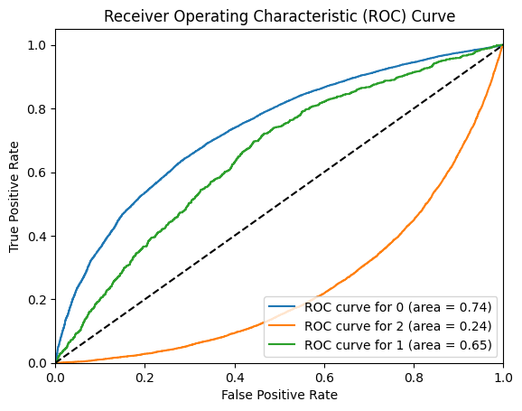
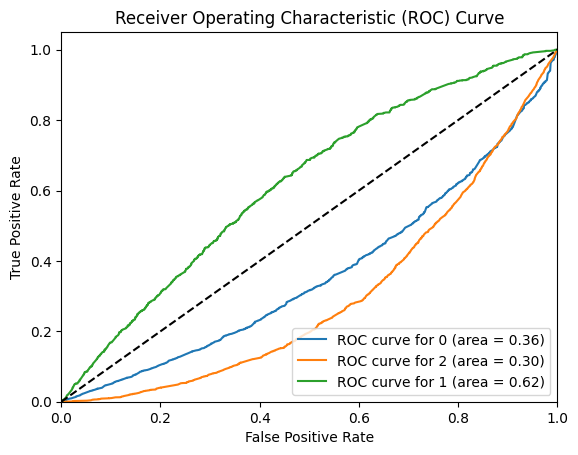

## Train-Test Split Report

- Train: 512886 obs, 170962 no diabetes [0], 170962 pre-diabetes [1], 170962 diabetes [2]
- Test: 50736 obs, 42741 no diabetes [0], 926 pre-diabetes [1], 7069 diabetes [2]

## Logistic Model Test Report

log-classifier-[p_0.4394]-[r_0.5193]-[f_0.4118]-[a_60.7912]

- Precision: [no diabetes] 0.9571128550900851, [pre-diabetes] 0.3327771329077191, [diabetes] 0.028437468147997146
- Recall: [no diabetes] 0.6077770758756229, [pre-diabetes] 0.6488895176121092, [diabetes] 0.30129589632829373
- F1-Score: [no diabetes] 0.7434532497638877, [pre-diabetes] 0.43993669975543087, [diabetes] 0.051969823973176864
- Support: [no diabetes] 42741, [pre-diabetes] 7069, [diabetes] 926
- Accuracy: 60.7912%
- Macro-F1: 0.4118

- AUC for 0: 0.58
- AUC for 1: 0.41
- AUC for 2: 0.43

## Tree Model Test Report

tree-classifier-[p_0.4366]-[r_0.5043]-[f_0.4296]-[a_67.3407]

- Precision: [no diabetes] 0.9407131011608624, [pre-diabetes] 0.34125237191650853, [diabetes] 0.02788074133763094
- Recall: [no diabetes] 0.6901335953768045, [pre-diabetes] 0.6360164096760503, [diabetes] 0.18682505399568033
- F1-Score: [no diabetes] 0.7961725845850709, [pre-diabetes] 0.4441809918988342, [diabetes] 0.048520544103211334
- Support: [no diabetes] 42741, [pre-diabetes] 7069, [diabetes] 926
- Accuracy: 67.3407%
- Macro-F1: 0.4296

- AUC for 0: 0.81
- AUC for 1: 0.68
- AUC for 2: 0.68

## FFNN Test Report

ffnn-classifier-[p_0.4161]-[r_0.3972]-[f_0.3869]-[a_76.0742]

- Precision: [no diabetes] 0.8749764506405425, [pre-diabetes] 0.028270136863361005, [diabetes] 0.344954128440367
- Recall: [no diabetes] 0.8693058187688636, [pre-diabetes] 0.13606911447084233, [diabetes] 0.18616494553685103
- F1-Score: [no diabetes] 0.8721319171410129, [pre-diabetes] 0.04681404421326398, [diabetes] 0.2418228592429254
- Support: [no diabetes] 42741, [pre-diabetes] 926, [diabetes] 7069
- Accuracy: 76.0742%
- Macro-F1: 0.3869

- AUC for 0: 0.57
- AUC for 1: 0.49
- AUC for 2: 0.50

<!-- ## Without prep_data in predict()

### Log Test Report

- Precision: [no diabetes] 0.9571128550900851, [pre-diabetes] 0.3327771329077191, [diabetes] 0.028437468147997146
- Recall: [no diabetes] 0.6077770758756229, [pre-diabetes] 0.6488895176121092, [diabetes] 0.30129589632829373
- F1-Score: [no diabetes] 0.7434532497638877, [pre-diabetes] 0.43993669975543087, [diabetes] 0.051969823973176864
- Support: [no diabetes] 42741, [pre-diabetes] 7069, [diabetes] 926
- Accuracy: 60.7912%
- Macro-F1: 0.4118

### Tree Test Report
- Precision: [no diabetes] 0.9407131011608624, [pre-diabetes] 0.34125237191650853, [diabetes] 0.02788074133763094
- Recall: [no diabetes] 0.6901335953768045, [pre-diabetes] 0.6360164096760503, [diabetes] 0.18682505399568033
- F1-Score: [no diabetes] 0.7961725845850709, [pre-diabetes] 0.4441809918988342, [diabetes] 0.048520544103211334
- Support: [no diabetes] 42741, [pre-diabetes] 7069, [diabetes] 926
- Accuracy: 67.3407%
- Macro-F1: 0.4296

 -->